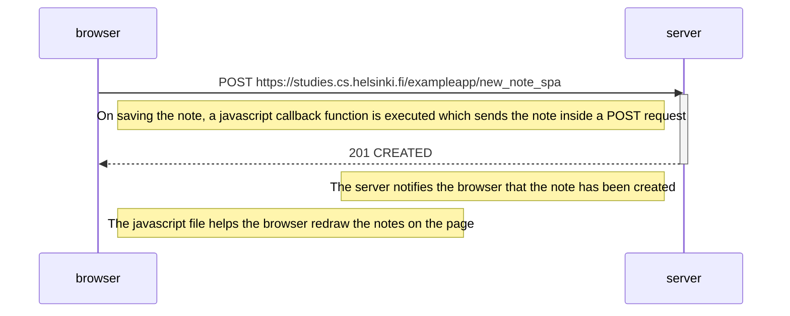

```mermaid
sequenceDiagram
    participant browser
    participant server

    browser->>server: POST https://studies.cs.helsinki.fi/exampleapp/new_note_spa
    activate server

    Note right of browser: On saving the note, a javascript callback function is executed which sends the note inside a POST request

    server-->>browser: 201 CREATED
    deactivate server

    Note left of server: The server notifies the browser that the note has been created
    Note right of browser: The javascript file helps the browser redraw the notes on the page
```